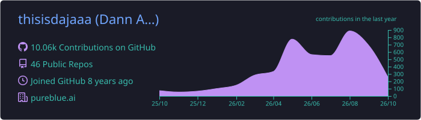

<div align="center">


<a href="https://github.com/thisisdajaaa">
  
</a>

<br/>

<a href="mailto:adannanthony@gmail.com"></a>
<a href="https://www.linkedin.com/in/dannastillero/"></a>
<a href="https://dajakmpm-portfolio.vercel.app/"></a>
<a href="https://dota-den.vercel.app"></a>


</div>

---

### 🧠 About Me

```ts
const dann = {
  role: "Full-Stack Engineer",
  builds: ["AI agent platforms", "multi-tenant SaaS", "field-service & workforce tools"],
  stack: ["TypeScript", "React", "Next.js", "Node.js", "NestJS", "MongoDB", "PostgreSQL", "AWS"],
  ai: ["Claude", "OpenAI", "Groq", "Gemini", "RAG", "MCP", "tool calling"],
  habits: ["typed end to end", "tests in CI", "ADRs for big decisions"],
  funFact: "Dota 2 + anime late-night combo 🎮🍜",
};
```

- 🤖 I build **production AI agents**: workflow engines, RAG, MCP tool calling and human handoff
- 🏢 I like **multi-tenant SaaS** problems: tenant isolation, auth across domains, provisioning, billing
- 🧪 I care about **boring reliability**: Playwright E2E, architecture tests, queues that survive bad networks
- 📫 Reach me on [LinkedIn](https://www.linkedin.com/in/dannastillero/) or by [email](mailto:adannanthony@gmail.com)

---

### 🚀 What I've Been Shipping

<table>
<tr>
<td width="50%" valign="top">

#### 🤖 AI Agent Platform
Multi-tenant platform where businesses build chatbot personas that run real workflows.

- Chatbots run as **state machines** with versioned workflows and rewind
- **LLM-generated** personas and workflows from API docs
- **RAG** with per-tenant vector search
- **MCP tool calling** across Anthropic, OpenAI and Groq
- Live **human handoff** over SMS and email
- Moved 700+ tenants to a new cluster with **zero failures**

</td>
<td width="50%" valign="top">

#### 🛠️ Field-Service SaaS
Work orders, quotes, invoices and technicians for HVAC and home-service teams.

- **AI Report Builder**: plain English in, scheduled reports out
- **AI diagnose & repair** with equipment nameplate OCR
- **Stripe** Checkout, ACH and payment QR codes
- Customer portal with **OTP login** and quote approval
- Multi-provider **SMS routing** and drive-time ETA texts
- Offline-tolerant chat with WebSocket replay

</td>
</tr>
<tr>
<td width="50%" valign="top">

#### 🧭 Agentic Workflow Runtime
About 70 markdown-defined workflows: the LLM decides, deterministic code acts.

- Worker pool with **leader election**
- **Natural-language reporting** that reads the schema before querying
- Sets up a **new tenant from scratch**: database, roles, branding, DNS, QA gate
- Partner API integrations with idempotency and tests

</td>
<td width="50%" valign="top">

#### 👥 Workforce & Staffing Platform
Admin app, API and employee portal for a staffing company.

- **Claude-powered** email templates and themes generated from documents
- "**Ask a question**" reporting that turns questions into queries
- Large report suite moved to **PostgreSQL**
- Clerk and Auth0 running side by side
- **CI/CD to AWS** with GitHub OIDC and Terraform

</td>
</tr>
</table>

<sub>Most of this is private client work, so the code isn't public. I'm happy to walk through the architecture.</sub>

---

### 🌟 Featured Projects

| Project | What it is | Built with |
|---|---|---|
| 🎮 [**Dota Den**](https://github.com/thisisdajaaa/dota-den) · [live](https://dota-den.vercel.app) | Dota 2 companion: honest match & MMR tracking, Captain's Mode draft practice against an **AI captain**, draft challenges, live pro games. Modular monolith with architecture tests and ADRs. | Next.js 16 · React 19 · MongoDB · Zod · Playwright |
| 🩺 **PulseFlow** <sub>(in progress)</sub> | Clinic management SaaS with a **database per clinic**, a real-time patient queue, SOAP notes with an amendment audit trail, and a Claude triage assistant with safety guardrails. | NestJS · Socket.IO · Clerk · Stripe · Anthropic |
| 🧬 [**Leptospirosis Case Study**](https://github.com/thisisdajaaa/leptospirosis-case-study-slideshow) · [live](https://thisisdajaaa.github.io/leptospirosis-case-study-slideshow/) | Interactive medical concept-map slideshow with step-by-step reveals and draggable nodes. | React Flow · Framer Motion · Tailwind |
| 🌾 [**Karosa**](https://github.com/thisisdajaaa/karosa-native) | Agricultural e-commerce marketplace app with about 40 screens, covering buyer checkout and seller shop management. | React Native · Expo · Redux-Saga · Postgres |
| 💬 [**Codev Feedback System**](https://github.com/thisisdajaaa/codev-feedback-system) · [live](https://codev-feedback-system.vercel.app) | Internal feedback platform with a Storybook-driven UI. | Next.js · Redux · MongoDB · Storybook |

---

### 🛠️ Tech Stack

<div align="center">

**Languages**


**Frontend**


**Backend**


**Data, Cloud & DevOps**


**Testing**


**AI / LLM**


**Platform & Integrations**


</div>

---

### 📊 GitHub Stats

<div align="center">




<br/><br/>


<br/><br/>



<br/><br/>

<picture>
  <source media="(prefers-color-scheme: dark)" srcset="./profile/snake-dark.svg"/>
  <source media="(prefers-color-scheme: light)" srcset="./profile/snake.svg"/>
  
</picture>

</div>

---

<div align="center">

### ✨ Most used line of code

```bash
git commit -m "feat: ship it"
```

_Thanks for stopping by. Let's build something cool together._ 🚀


</div>
